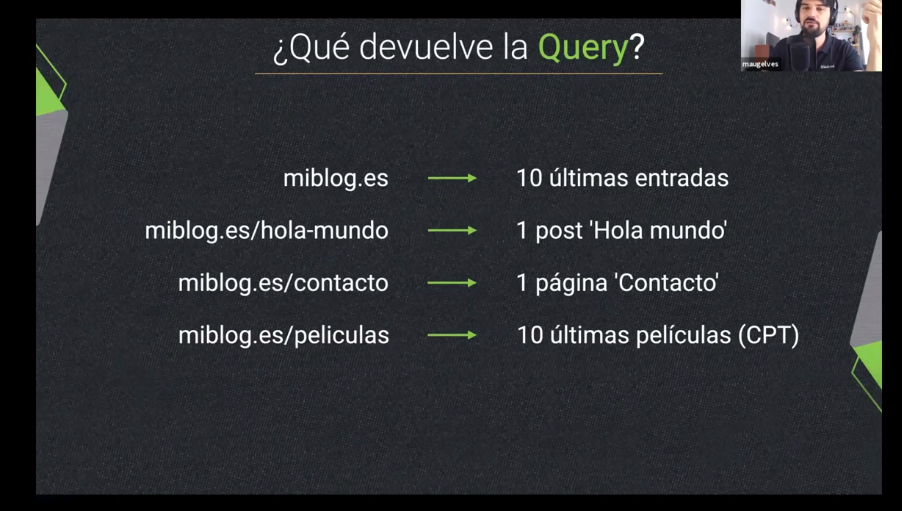
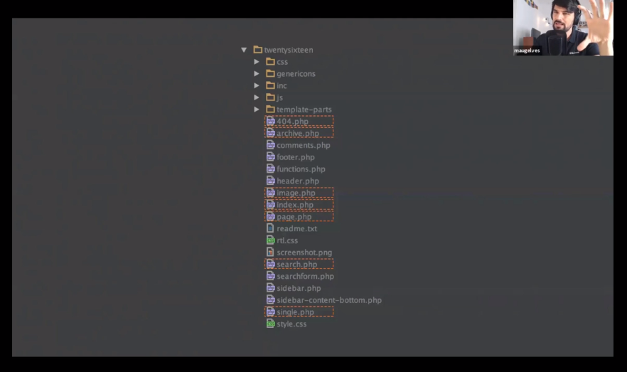

# Wordpress

```
User: wpadmin
Pass: farsa
```

## BBDD

La información en Wordpress se guarda principalmente en la tabla `wp_posts`.
Si queremos ver los contenidos de tipo 'Entradas' debemos hacer la siguiente consulta:

```sql
select * wp_posts
where post_type = 'post'
```

La bbdd de wordpress consta de 12 tablas, la tabla `wp_posts` está mal concebida, en sus orígenes wordpress se ideó como un blog,
pero con el paso del tiempo ha evolucionado y en esta es el corazón de wordpress y almacena todo tipo de contenidos.

Tablas:

```
wp_posts => 
    wp_postsmeta
wp_users => 
    wp_usersmeta
wp_comments => 
    wp_commentsmeta
wp_terms 
    => wp_termsmeta
    
wp_options
wp_links
wp_term_relationships
wp_term_taxonomy
```
Las tablas meta se utilizan para guardar información adicional a modo de columnas y que no existen en la estructura de la tabla 
principal, así cada línea que se añada a la tabla meta funcionará a modo de columna en la tabla principal, con esta estructura
se consigue añadir infinitos campos/columnas adicionales sin tener que crear nuevas columnas en la tabla para ello.

La tabla `wp_options` no esta asociada a ninguna otra y los plugins la utilizan para guardar su configuración en ella.
Por defecto al entrar a la página principal de wordrpess, éste nos devuelve las diez últimas entradas (posts)



Son 10 porque por defecto wordpress lo tiene así configurado en ajustes.

## WP_QUERY

Es la clase que utiliza wordpress para realizar consultas a bbdd, es muy amplia y abstrae al usuario del lenguaje SQL.
Es importante tras hacer una consulta personalizada utilizando esta clase llamar a la función: `wp_reset_postdata()` ya que 
ya que Worpress utiliza el loop para otras muchas operaciones.

Ejemplo del loop de wordpress::

```phpt
$query = new WP_Query($args);
if ($query->have_posts()) {
    while ($query->have_posts()) {
        //do something
    }
} else {
    //no results found
}

wp_reset_postdata();
```

Esta es la estructura de ficheros de un tema de wordpress: 



Dos tipos de plantillas 
- Simples
- Colecciones

Estructura de archivos en wordpress para el renderizado [wphierarchy.com](https://wphierarchy.com)
Se puede alterar el comportamiento de la consulta de wp con la función `pre_get_the_posts()`

## Temas básicos para wordpress y gratuitos

Temas básicos para comenzar con wodpress:
[andersnoreng](https://andersnoren.se/teman/)

## Hooks en wordpress:
 - Filtros: Modificar comportamientos antes de guardar en bbdd o mostrar información en el navegador
```phpt
add_filter('the_title', 'my_custom_function' 10, ['args'])
```
 - Acciones: Son parte del funcionamiento interno de wordpress
```phpt
add_action('the_content', 'my_custom_function', 10, ['args'])
```
## Shortcodes

Wordpress tiene un listado de Shortcodes ya predefinidos, se pueden ver en la siguiente url:
[wordpress shortcodes](https://kinsta.com/es/blog/codigos-cortos-wordpress/#los-shortcodes-predeterminados-de-wordpress).

El programaddor también puede crear sus propios shortcodes, de manera similar a los plugins.

```phpt
add_action('init', 'register_shortcode');

function register_shortcode()
{
    add_shortcode('sc', 'custom_sc');
}

function custom_sc($args, $content)
{
    return '<b style="color:'.$args['color'].'">' . strtoupper($content) . '</b>';
}
```

## Metadata

Además de los campos predifinidos dentro de la tabla `wp_posts` el usuario puede definir nuevos campos personalizados para
el contenido de tipo post/entrada. Para ello se utiliza una estructura similar a la siguiente:

```phpt
add_action('add_meta_boxes', 'my_metabox'); //añadir metabox para el metadata
add_action('save_post', 'my_metaboxes_save'); //salvar la información añadida al metabox

function my_metabox()
{
    add_meta_box('custom_metabox', 'my custom box', 'custom_handler', 'post');
}

function custom_handler()
{
    $values = get_post_custom($post->ID);
    $contentValue = esc_attr($values['custom_field'][0]);
    echo '<label for="jahernan_field">jahernan custom field</label>' .
        '<input type="text" id="custom_field" name="custom_field" value="'.$contentValue.'"/>';
}

function my_metaboxes_save($postId)
{
    // prevent autosave post editing
    if (defined('DOING_AUTOSAVE') && DOING_AUTOSAVE) {
        return;
    }

    // check if current user can edit post
    if (!current_user_can('edit_post')) {
        return;
    }

    if (isset($_POST['custom_field'])) {
        update_post_meta($postId, 'custom_field', ($_POST['custom_field']));
    }
}
```
El dato se almacenará en la tabla `wp_postsmeta` para el post cuyo identificador sea `$post->ID` con la clave `custom_field`

## Widgets

Para crear widgets personalizados basta con crear dentro del plugin una nueva clase que extienda de la clase `WP_Widget`.

```phpt
class CustomWidget extends WP_Widget
{
    function __construct($id_base, $name, $widget_options = array(), $control_options = array())
    {
        parent::__construct($id_base, $name, $widget_options, $control_options);
    }
    
    function form($instance)
    {
        return parent::form($instance); // Define el formulario backend del widget.
    }
    
    function update($new_instance, $old_instance)
    {
        return parent::update($new_instance, $old_instance); // Define la lógica de salvado de la info relativa al widget
    }
    
    function widget($args, $instance)
    {
        parent::widget($args, $instance); // Visualización del widget en el frontend
    }
}
```
Para registrar un widget se hace uso del siguiente hook de la siguiente manera:

```phpt
function custom_widget_init()
{
    register_widget('CustomWishListWidget');
}
add_action('widgets_init', 'custom_widget_init');
```

## Añadir javascript a wordpress

```phpt
function custom_init()
{
    //registrar un javascript personalizado
    wp_register_script('custom-script-js', plugins_url('/custom-script.js', __FILE__), ['jquery']);

    wp_enqueue_script('jquery');
    wp_enqueue_script('custom-wishlist-js');

    global $post;
    // añadir objetos javascript a la página
    wp_localize_script('custom-script-js', 'WishList', ['postId' => $post->ID, 'action' => 'ajax_action']);
}
add_action('wp', 'custom_init');
```

## Añadir ajax a WP

```phpt
// add custom ajax action using hook 'wp_ajax'
function ajax_action()
{
    //do someting

    exit();
}
//add_action('wp_ajax_nopriv_add_wishlist', 'ajax_action'); //usuario anonimo
add_action('wp_ajax_add_wishlist', 'ajax_action'); //usuario logado
```